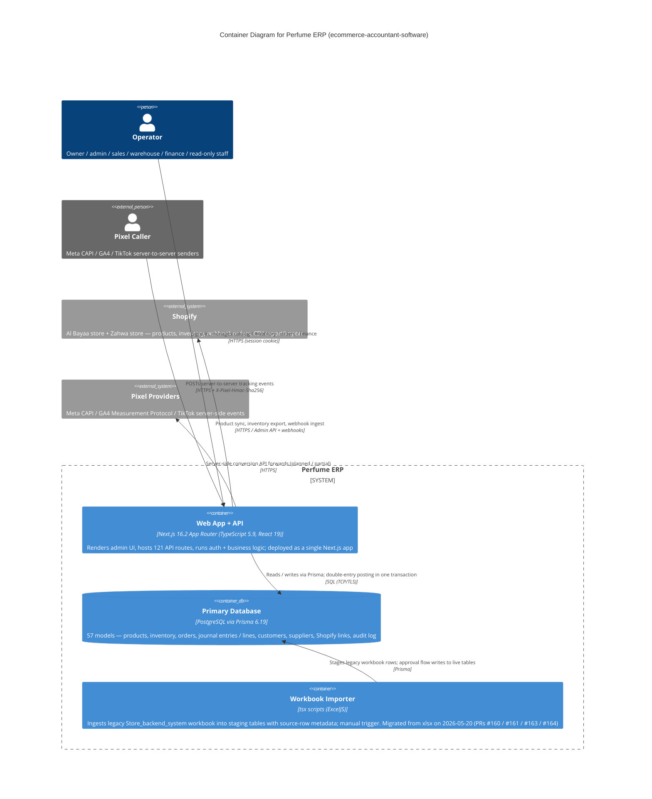

# Container Diagram — ecommerce-accountant-software (Perfume ERP)

> **C4 Level 2** — the system broken down into deployable/runnable containers. Audience: the dev team. One diagram per managed project; usually zoomed in from the L1 context diagram.

## Diagram

> **Note**: this diagram was auto-generated by /handover on 2026-05-20 from repo signals (package.json, .github/workflows, prisma/schema.prisma, .env.example, src/app/api). It is a **starting point** — review and refine.
>
> - Container labels and tech strings — the detector may have picked a framework version wrong (Next 16.2 is current as of this assessment but very new).
> - Inferred relationships — `operator → web_api` assumes HTTPS + the project's HMAC session cookie. Adjust if the deployment fronts it with something else (e.g. Vercel auth, Cloudflare Access).
> - External systems — anything not in `package.json` / `.env.example` won't have been detected. The project's `docs/ARCHITECTURE.md` mentions a planned Shopify webhook HMAC verification "Phase 5"; cross-check with that doc when refining.
> - The Workbook Importer is drawn as a separate container because it's a `tsx` script invoked out-of-band, but it shares the Next.js process at runtime (same Prisma client, same DB). Split or merge as your deployment shape settles.
>
> Update the "Maintenance" section below once the diagram is stable.

## Maintenance

(From the template — update when L2 containers change.)
